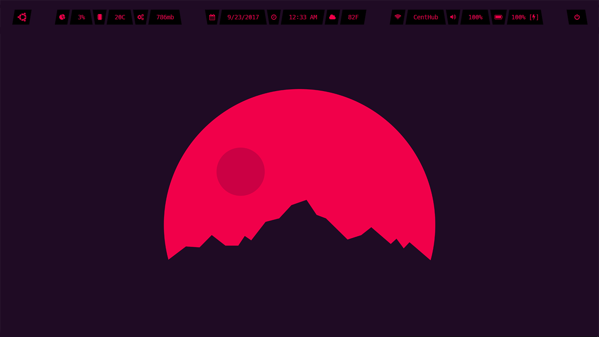

# gr8bar
A cross-platform status bar made with Qt5




## Prerequisites 

### PyQt5
```
pip3 install PyQt5
```

## Trying it out
You can try out by running:

```
python3 ./src/gr8bar.by ./test/config.py
```

## TODO
- Inline options
- Stateful labels
- Easy shell commands